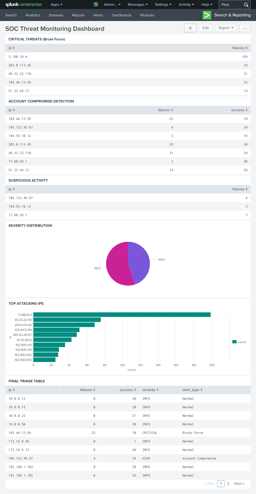

# 🛡️ SOC Log Analysis & Alert Triage using Splunk

## 📌 Overview
This project simulates a real-world **Security Operations Center (SOC)** workflow using Splunk.

It demonstrates how security logs are ingested, analyzed using SPL (Search Processing Language), and transformed into actionable insights through detection rules, alert triage, and dashboards.

---

## 🚀 Key Features
- 📥 Log ingestion into Splunk
- 🔍 Detection of security threats using SPL queries
- ⚠️ Alert triage with severity classification
- 📊 Interactive dashboard for monitoring threats
- 🧠 Correlation of events to identify attack patterns

---

## 🔍 Detection Use Cases

### 🔴 Brute Force Attack
- Detects IPs with multiple failed login attempts (≥5)

### 🔴 Account Compromise
- Identifies failed login attempts followed by successful login

### 🟠 Suspicious Activity
- Detects low-frequency failed login attempts

---

## 📊 Dashboard Panels

1. **Brute Force Detection**  
   Identifies IPs with high number of failed login attempts  

2. **Account Compromise Detection**  
   Detects potential compromised accounts  

3. **Suspicious Activity Detection**  
   Flags unusual login behavior  

4. **Severity Distribution**  
   Visualizes alert severity levels  

5. **Top Attacking IPs**  
   Displays most active malicious IPs  

6. **Final Alert Triage (Core Feature)** ⭐  
   Correlates events and prioritizes alerts based on severity and attack type  

---

## 🧠 Alert Triage Logic

| Condition | Severity | Alert Type |
|----------|--------|-----------|
| ≥5 failures | CRITICAL | Brute Force |
| ≥3 failures + success | HIGH | Account Compromise |
| 2–4 failures | MEDIUM | Suspicious Activity |
| Others | INFO | Normal |

---

## 🛠️ Tools Used
- Splunk Enterprise  
- SPL (Search Processing Language)  

---

## 🏗️ Architecture
Logs → Splunk Ingestion → SPL Detection Rules → Alert Triage → Dashboard Visualization  

---

## 📸 Dashboard Preview

---

## 📈 Learning Outcomes
- Hands-on experience with Splunk  
- Writing SPL queries for threat detection  
- Understanding SOC workflows  
- Alert triage and prioritization  
- Dashboard-based monitoring  

---

## 🎯 Resume Impact
This project demonstrates:
- Practical knowledge of SIEM tools (Splunk)  
- Ability to detect and analyze cyber threats  
- Understanding of real SOC operations  

---

## ⚠️ Disclaimer
This project is for educational purposes only.

---

## 👨‍💻 Author
**Vallepu Suseela**  
Cybersecurity Enthusiast | SOC Analyst Aspirant
